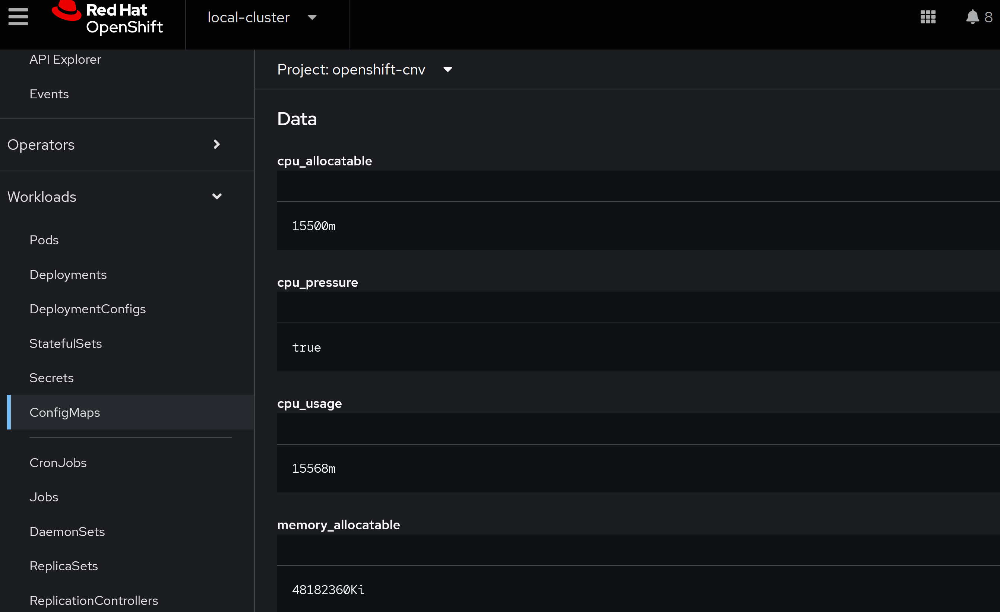
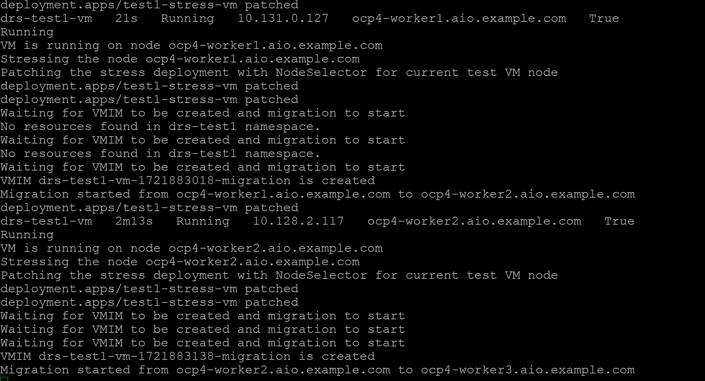
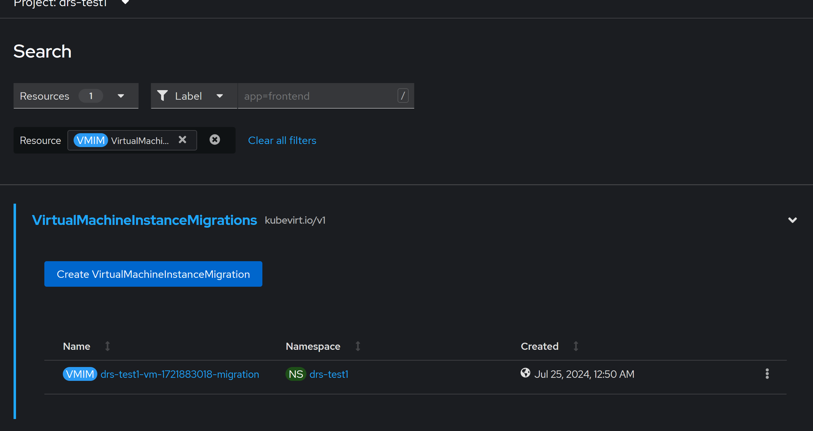

# poor-mans-drs
A Red Hat Advanced Cluster Management(ACM) Policy that migrates VM's from nodes that have high cpu and memory usage.

How does it do this:  
    - ACM will loop through every worker node and get their allocatable CPU/Memory  
    - ACM will loop through every worker node and get their current CPU/Memory Usage  
    - ACM policy sets a value for usage % to start migrating nodes, default is set to 50%. Value can be changed in policy.  
    - ACM will create a configmap called drs-worker-node-name-info on openshift-cnv with the values obtained and calculated from above.  
    - ACM will loop through virtual machines and compare the status of the nodes they are running on with the values calculated above.  
    - If node VM is on has high memory and cpu usage, ACM will highlight VM for migration.
    - ACM will check if their is an existing migration for that VM that is not Failed or Succeded status i.e A running Migration. If there is nor running migration ACM will create a new VM Migration object to move the VM.  

## Tested On 
- OCP 4.15
- ACM 2.11

## Deployment steps
- Install ACM
- Install OpenShift Virtualization
- Steps must be run with cluster-admin privileges

- Steps might require subscription-admin privilege  

    ```bash
    oc adm policy add-cluster-role-to-user open-cluster-management:subscription-admin $(oc whoami)
    ```

- Create Sample Deployment artifacts
    ```bash
    oc apply -k ./deploy
    ```

- To exclude a VM from being managed by this policy label the VM with "acm-drs/exclude"

- ACM ManagedClusterSetBinding selects the global clusterset to make it easier to test.

- Change the Policy Evaluation Interval to control response times.

- You can run one of the below test scenarios  

   
    Test1:  
     Running a stress-ng test pod that moves with the VM. Script below will get VM node and apply a node selector for the same node to the stress-ng pod.The stress-ng pod will stress the node CPU which should trigger the ACM policy to create a VM Migration to move the VM to another node. After a small wait the process should start all over again.

    - Start test and create Infra
    ```bash
    ./test/test1/test1.sh start
    ```

    - Exit from Test- CTRL-C from previous command and run below

    ```
    ./test/test1/test1.sh stop
    ```

    Test1 Verification:
    - Once test starts you should see increased load on the stressed node.
    
    - You can confirm from the configmap created by the policy for tracking metrics. Will be the same as the node on openshift-cnv namespace.
    

    - Script logs will also tell the source and target VM's for Node migrations.
    

    - You can also list the VMIM objects to see the migrations.
    


    